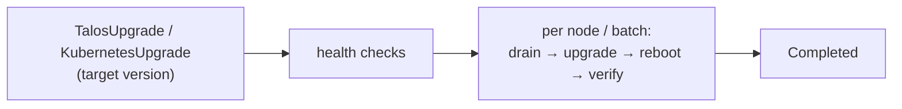

# tuppr

A Kubernetes controller for automated, orchestrated upgrades of **Talos Linux**
and **Kubernetes**. You declare a target version in a custom resource; tuppr
plans and executes the rollout - draining, upgrading, rebooting, and
health-checking each node in turn (or in parallel batches) - and always drives
the upgrade from a healthy node, so the controller never self-upgrades the node
it is running on.

tuppr manages two kinds of upgrade, each its own custom resource in the
`tuppr.home-operations.com/v1alpha1` API group:

| Resource            | Upgrades              | Reboot | Per cluster                    |
| ------------------- | --------------------- | ------ | ------------------------------ |
| `TalosUpgrade`      | Talos Linux on nodes  | Yes    | Many (queued), node-selectable |
| `KubernetesUpgrade` | The Kubernetes version | No    | Exactly one                    |

Only one upgrade ever runs at a time across the cluster: multiple `TalosUpgrade`
plans queue and execute one-by-one, and a `TalosUpgrade` and a
`KubernetesUpgrade` never run concurrently. See
[Upgrade coordination](coordination.md).

## When to use it

- You run Talos Linux and want version upgrades driven by the Kubernetes API
  (GitOps-friendly) instead of running `talosctl upgrade` by hand.
- You want the rollout orchestrated: health-gated, one plan at a time, with
  drain, reboot, and node-readiness verification handled for you.
- You want to keep the Kubernetes version in step with Talos through the same
  declarative flow.

## When _not_ to use it

- You need tuppr to pick a _safe_ version for you. It upgrades to exactly the
  version you specify and does not enforce Talos's sequential upgrade path -
  that is your responsibility (see
  [Versioning and safe upgrade paths](versioning.md)).
- You are not on Talos. tuppr drives upgrades over the Talos API; it is not a
  general-purpose node OS upgrader.

## Where to next

- **[Requirements](requirements.md)**: Talos API access, namespace, supported
  versions.
- **[Quickstart](quickstart.md)**: install the chart and run your first Talos
  and Kubernetes upgrades.
- **[Upgrade coordination](coordination.md)**: how plans queue and why the two
  upgrade kinds never overlap.
- **[Talos upgrades](talos-upgrades.md)**: policies, parallelism, hooks,
  maintenance windows, per-node overrides, and health checks.
- **[Kubernetes upgrades](kubernetes-upgrades.md)**: the single-resource model
  and its history.
- **[Notifications](notifications.md)**: send upgrade notifications through
  Apprise, customize them with templates, and route them through
  [chaski](https://github.com/home-operations/chaski).
- **[Monitoring](monitoring.md)**: metrics, alerts, and the Grafana dashboard.
- **[Operations](operations.md)**: watching, suspending, retrying, and
  troubleshooting upgrades.
- **[Helm chart values](configuration.md)**: every chart knob.
