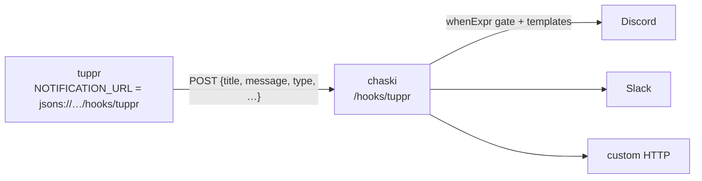

# Notifications

tuppr can send a notification as each node's Talos upgrade begins. Delivery goes
through [apprise-go](https://github.com/unraid/apprise-go), so a single URL can
target any of Apprise's 100+ services (Discord, Telegram, Gotify, ntfy,
Pushover, email, generic webhooks, …).

/// note | Scope today
Notifications fire when a **node's Talos upgrade starts**. `KubernetesUpgrade`
does not emit notifications, and there are no success/failure notifications yet.
///

## Enable

tuppr reads the notification URL from a Secret so the credential never lands in
a `TalosUpgrade` or in chart values. Create the Secret, then point the chart at
it:

```yaml
apiVersion: v1
kind: Secret
metadata:
  name: tuppr-notifications
  namespace: system-upgrade
stringData:
  # An Apprise URL - see https://appriseit.com/services/
  url: discord://webhook_id/webhook_token
```

```yaml
# Helm values
notification:
  enabled: true
  secretName: tuppr-notifications
  secretKey: url # key within the Secret (default: url)
```

## The notification URL

The URL uses **Apprise** syntax (not shoutrrr). A few common shapes:

| Service  | Example URL                              |
| -------- | ---------------------------------------- |
| Discord  | `discord://webhook_id/webhook_token`     |
| Telegram | `tgram://bottoken/ChatID`                |
| Gotify   | `gotifys://gotify.example.com/token`     |
| ntfy     | `ntfys://ntfy.sh/my-topic`               |
| Pushover | `pover://user_key@token`                 |

The authoritative per-service syntax (and every other supported service) is at
<https://appriseit.com/services/>.

## Customize the title and message

Both the title and message are rendered as Go templates, so you can tailor them.
Leave a template empty to keep the built-in default.

```yaml
notification:
  enabled: true
  secretName: tuppr-notifications
  titleTemplate: "🚀 Talos upgrade — {{ .Node }}"
  messageTemplate: "{{ .Node }} → Talos {{ .TargetVersion }} (plan {{ .Plan }})"
```

**Context** available to both templates:

| Field             | Value                                            |
| ----------------- | ------------------------------------------------ |
| `.Node`           | The node being upgraded.                         |
| `.CurrentVersion` | Its current Talos version (empty if undetermined). |
| `.TargetVersion`  | The target Talos version.                        |
| `.Plan`           | The `TalosUpgrade` resource name.                |

**Functions** are the [go-sprout/sprout](https://github.com/go-sprout/sprout)
safe helper set plus a strict `env` (`{{ env "NAME" }}`, which errors on an
unset variable). Filesystem, network, and the sprig-backward aliases are
excluded, so a template can't read a file or make a network call.

/// warning | sprout function names differ from sprig
sprout renames some helpers - it is `toUpper`, not `upper`, and the
sprig-backward aliases are intentionally absent. Check the
[go-sprout/sprout](https://github.com/go-sprout/sprout) registry list for the
exact names.
///

## Route through chaski

[chaski](https://github.com/home-operations/chaski) is a small webhook→
notification relay: it receives JSON, gates it with a
[CEL](https://cel.dev/) expression, renders templates, and forwards to one or
more targets. Putting chaski between tuppr and your providers adds **CEL gating,
fan-out to several destinations, and provider conversion** on top of tuppr's
single-target send - and lets you centralize routing for more apps than just
tuppr.

The trick: tuppr targets chaski using Apprise's generic **JSON** target, which
POSTs to an HTTP endpoint.



**tuppr side** - put a `json://` (HTTP) or `jsons://` (HTTPS) URL pointing at
chaski's `/hooks/{route}` endpoint in the notification Secret:

```yaml
stringData:
  # route "tuppr"; in-cluster chaski Service on port 8080
  url: json://chaski.system-upgrade.svc.cluster.local:8080/hooks/tuppr
```

Apprise's JSON target POSTs a body like this, which chaski exposes to CEL and
templates as `payload`:

```json
{ "version": "1.0", "title": "Tuppr Upgrade Started", "message": "Node worker-01 is upgrading Talos from v1.13.6 -> v1.13.7", "type": "info", "attachments": [] }
```

**chaski side** - a route named `tuppr` that gates on the payload and fans out.
Here it forwards every upgrade to Discord and, for the `west` nodes only, also
to a PagerDuty-style HTTP endpoint:

```yaml
targets:
  discord:
    apprise:
      url: '{{ env "DISCORD_URL" }}'
  oncall:
    http:
      url: '{{ env "ONCALL_WEBHOOK" }}'
      method: POST

routes:
  tuppr:
    target: discord
    # Relay every tuppr notification to Discord, retitled.
    title: "Talos rollout"
    message: "{{ .payload.message }}"
  tuppr-oncall:
    target: oncall
    # Only page when a west-zone node starts upgrading.
    whenExpr: payload.message.contains("worker-west")
    message: "{{ .payload.message }}"
```

/// tip | Test without sending
chaski accepts `?dryRun=1` to preview which targets match and what would render
(including `"fired": false` when a `whenExpr` gate doesn't match), so you can
confirm a route before wiring tuppr to it. Inbound token auth is off by default,
which is fine for cluster-internal senders like tuppr; set `CHASKI_WEBHOOK_TOKEN`
to require a bearer token.
///

Because tuppr sends plain text, keep the chaski templates referencing
`{{ .payload.message }}` / `{{ .payload.title }}`. For the full chaski
configuration surface (signature verification, per-target params, HTTP forward
options), see the [chaski README](https://github.com/home-operations/chaski).
